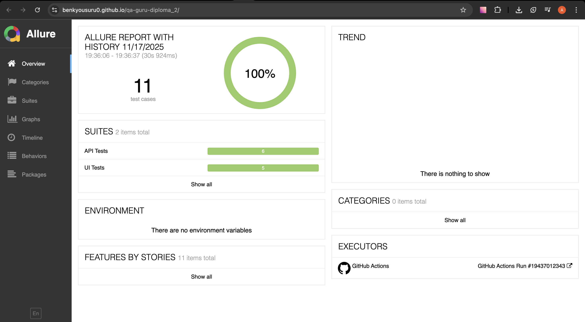
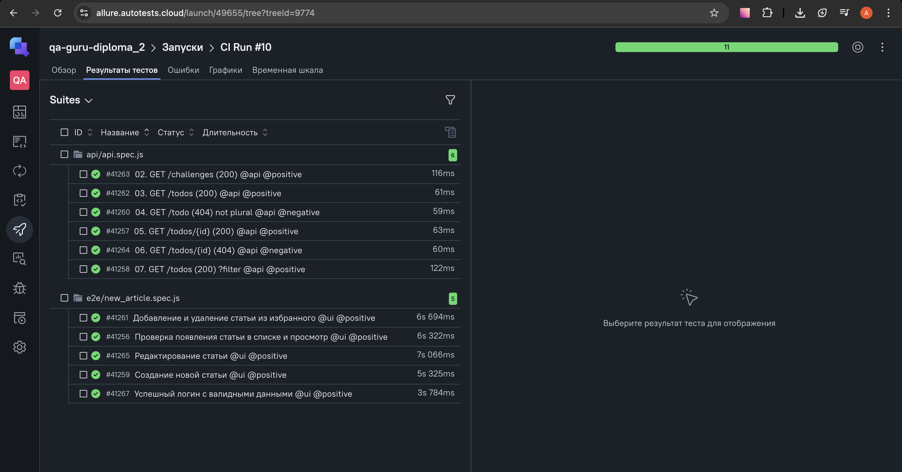
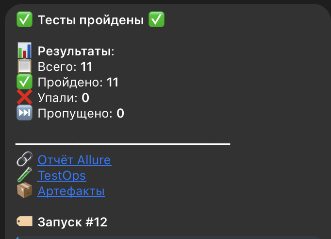

# 🎓 Diploma Project — Playwright + Allure + CI/CD

Цель проекта — продемонстрировать навыки автоматизации, полученные в рамках курса QA.GURU.
В проект включены UI и API тесты, настроены CI/CD, Allure-отчёты, деплой на GitHub Pages, а также интеграция с TestOps.

## 📚 Содержание

- [Описание](#-описание)
- [Allure-отчёт](#-allure-отчёт)
- [TestOps](#-testops)
- [Telegram](#-уведомления-в-telegram)
- [Запуск](#-запуск-локально)


📝 Описание

Репозиторий содержит:
- **API-тесты** для `https://apichallenges.herokuapp.com`
- **UI-тесты** для `https://realworld.qa.guru`
- Написаны на **JavaScript** + **Playwright**
- Настроен **GitHub Actions**:
  - Запуск тестов
  - Allure-отчёты
  - Публикация на GitHub Pages
  - Интеграция с Allure TestOps
  - Уведомления в Telegram

Запуск — при пуше в `main` или `master`.

## 📊 Allure-отчёт

[👉 Посмотреть Allure report](https://benkyousuru0.github.io/qa-guru-diploma_2/)



Отчёт автоматически генерируется из файлов allure-results и публикуется в gh-pages.

## 🔗 TestOps

[👉 Перейти в Allure TestOps](https://allure.autotests.cloud/launch/49655/tree?treeId=0)



## 📢 Уведомления в Telegram

После каждого запуска приходит уведомление:



> Содержит:
> - Статус: ✅ Тесты пройдены / ❌ Тесты упали
> - Количество тестов
> - Ссылки на отчёты и артефакты

## 🏁 Запуск локально

Для локального запуска требуется:

1. Клонировать репозиторий: `git clone https://github.com/benkyousuru0/qa-guru-diploma_2.git`
2. Установить зависимости: `npm install`
3. Запустить все тесты: `npx playwright test`
4. При желании можно запустить тесты по тегам:
```
npm run t:ui
npm run t:api
npm run t:positive
npm run t:negative
```

## 📦 Используемые зависимости

devDependencies:

- @faker-js/faker
- @playwright/test
- allure-playwright
- eslint

dependencies:
- dotenv
- faker
